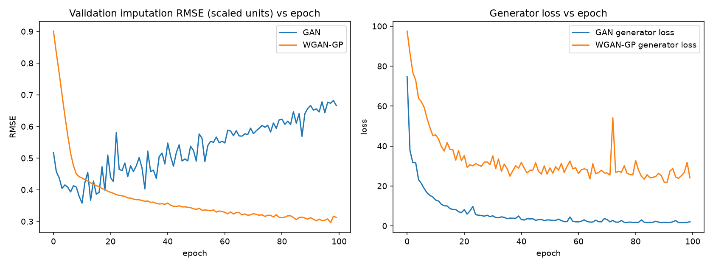

# Project guide: Adversarial Forecasting

**A GAN-based framework for time-series imputation and weather prediction**

This guide explains the whole project: what it does, where the data come from, how the data are prepared, how each model works and is trained, how every metric is computed, what the results are, and what each part of the notebook does. The numbers refer to the run stored in [`Adversarial_Forecasting_GAN.ipynb`](Adversarial_Forecasting_GAN.ipynb) and in [`outputs/`](outputs/).

## Contents

1. [What the project does](#1-what-the-project-does)
2. [Repository contents](#2-repository-contents)
3. [Data](#3-data)
4. [Data preparation, step by step](#4-data-preparation-step-by-step)
5. [Models](#5-models)
6. [Metrics](#6-metrics)
7. [Results](#7-results)
8. [Notebook walkthrough](#8-notebook-walkthrough)
9. [Output files](#9-output-files)
10. [Running the project](#10-running-the-project)
11. [Changes from the original notebook](#11-changes-from-the-original-notebook)
12. [Notes and assumptions](#12-notes-and-assumptions)
13. [Glossary](#13-glossary)
14. [References](#14-references)

---

## 1. What the project does

The project applies generative adversarial networks (GANs) to two tasks on daily weather data for Chennai, India:

1. **Imputation:** filling values that are missing from a six-variable daily record.
2. **Forecasting:** predicting the next 7 days of 2 m air temperature.

GAN-based imputation is an established research area (for example GAIN; Yoon et al., 2018). This project tests a further claim: **a unified, shared GAN architecture, with one generator for both tasks, is an optimized way to handle imputation and forecasting**. The shared approach is compared with a **Simple GAN** approach that trains a separate GAN for each task. "Optimized" is assessed on three criteria:

* **accuracy** on each task;
* **number of parameters** needed to perform both tasks;
* **training time** needed to obtain models for both tasks.

Three models are compared. Only GAN variants take part; no non-GAN baseline is included.

| Model | Generator | Adversary | Trained on | Evaluated on |
|---|---|---|---|---|
| **Shared GAN** | BiLSTM generator over 30-day blocks (shared architecture) | GAIN-style point-wise discriminator (binary cross-entropy) | imputation | imputation and forecasting |
| **Shared WGAN-GP** | same generator architecture | block-level Wasserstein critic with gradient penalty | imputation, with re-masking of observed values | imputation and forecasting |
| **Simple GAN** | one generator per task | GAIN-style discriminator (imputation); conditional discriminator (forecasting) | each task separately | the task it was trained for |

**Results in brief** (one run, seed 42; details in [Section 7](#7-results)):

* **Imputation:** the Shared WGAN-GP has the lowest error of the three models on all four metrics.
* **Forecasting:** the Simple GAN forecaster, trained for this task, has the lowest error; the other models' 7-day forecasts have a higher RMSE (41 % higher for the Shared WGAN-GP).
* **Cost:** each shared model handles both tasks with one generator of 146,886 parameters, 28 % fewer than the two Simple GAN generators, and with one training run.

---

## 2. Repository contents

```
├── Adversarial_Forecasting_GAN.ipynb   # the complete, executed study (open in Colab from the README badge)
├── PROJECT_GUIDE.md                    # this guide
├── README.md                           # short overview and results
├── data/
│   └── era5_chennai_1950_2025.csv      # ERA5-Land extract used in the study (27,757 days)
├── outputs/                            # tables and figures written by the notebook (see Section 9)
├── requirements.txt                    # Python packages
└── .gitignore
```

---

## 3. Data

### 3.1 Source

| Item | Value |
|---|---|
| Dataset | ERA5-Land daily aggregates, Earth Engine collection `ECMWF/ERA5_LAND/DAILY_AGGR` |
| Location | the ERA5-Land grid cell containing 80.23° E, 13.08° N (Chennai, India) |
| Period | 1950-01-02 to 2025-12-30 |
| Length | 27,757 daily records, no gaps |
| File | `data/era5_chennai_1950_2025.csv` |

ERA5-Land has no gaps, so missing values are created artificially ([Section 4.4](#44-artificial-missingness)). The values that are removed are kept and serve as the ground truth for scoring.

### 3.2 Variables

| Column | ERA5-Land band | Unit | Daily statistic | Role |
|---|---|---|---|---|
| `temp` | `temperature_2m` | °C (converted from K) | mean | **target** |
| `surface_pressure` | `surface_pressure` | Pa | mean | input |
| `total_precipitation_sum` | `total_precipitation_sum` | m | total | input |
| `dewpoint_temperature_2m` | `dewpoint_temperature_2m` | K | mean | input |
| `u_component_of_wind_10m` | `u_component_of_wind_10m` | m s⁻¹ | mean (eastward) | input |
| `v_component_of_wind_10m` | `v_component_of_wind_10m` | m s⁻¹ | mean (northward) | input |

### 3.3 How the notebook obtains the file

Section 1 of the notebook makes sure that `data/era5_chennai_1950_2025.csv` exists. It uses the first available source:

1. the local file, present in a clone of the repository;
2. the copy in the GitHub repository, downloaded automatically (for example in Colab);
3. a fresh extraction from Google Earth Engine with `extract_era5_land()`.

`extract_era5_land()` authenticates with Earth Engine, filters the collection to the study period, selects the six bands, and reads the values at the point for every day. It uses `reduceRegion` with `ee.Reducer.first()` at a 1,000 m scale and converts the result to a table with `geemap.ee_to_df`. Temperature is converted from kelvin to degrees Celsius. This option needs a Google Cloud project with the Earth Engine API enabled: set `GEE_PROJECT` in Section 1.

### 3.4 Licence

ERA5-Land is produced by ECMWF for the Copernicus Climate Change Service and distributed under the Licence to Use Copernicus Products. The extract in `data/` contains modified Copernicus Climate Change Service information (1950–2025). Neither the European Commission nor ECMWF is responsible for any use of this information.

---

## 4. Data preparation, step by step

```
CSV ──► load_data ──► chronological split into 30-day blocks ──► z-score scaling (training rows only)
    ──► inject_missing (seed 42) ──► zero-filled values + missing-value indicator ──► model input (blocks, 30, 12)
```

### 4.1 Loading

`load_data(path)` reads the CSV, parses the dates, sorts by date and keeps `date` and the six variables.

### 4.2 Chronological split

The 27,757 days are cut into non-overlapping 30-day blocks: 925 blocks. The last 7 days (2025-12-24 to 2025-12-30) do not fill a block. `chronological_split` assigns the blocks in time order:

| Split | Blocks | Rows | Dates |
|---|---|---|---|
| Training | 647 (70 %) | 0–19,409 | 1950-01-02 to 2003-02-22 |
| Validation | 138 (15 %) | 19,410–23,549 | 2003-02-23 to 2014-06-24 |
| Test | 140 (15 %) | 23,550–27,749 | 2014-06-25 to 2025-12-23 |

Every test day lies after every training day. The forecasting experiment uses the same period boundaries ([Section 5.6](#56-simple-gan-forecasting-network)).

### 4.3 Scaling

Each variable is z-scored with a `StandardScaler` fitted on the training rows only (rows 0–19,409), and the same transformation is applied to all rows. For temperature, the training mean is 27.76 °C and the training standard deviation is 2.759 °C.

### 4.4 Artificial missingness

`inject_missing` removes values independently for each of the six variables, with a random generator seeded at 42:

* **random days:** 10 % of the days are chosen at random and removed (single points);
* **gaps:** runs of 3 to 10 consecutive days (length drawn at random) are removed until they cover about 10 % of the days.

The two kinds can overlap. In total, 18.52 % of all values are removed (18.4–18.7 % per variable). Within the 140 test blocks, 702 of the 4,200 temperature values and 4,479 of the 25,200 values in total are removed. The same mask is used for every model.

### 4.5 Model input

* `make_indicator` turns the mask into missing-value indicator columns: 1 = missing, 0 = observed.
* `build_blocks` reshapes the series into blocks of 30 days and returns:
  * `true_blocks`: the true scaled values, used only for scoring;
  * `observed_blocks`: the values with every removed entry set to 0;
  * `mask_blocks`: the indicator (1 = missing);
  * `model_input`: `observed_blocks` and `mask_blocks` concatenated along the last axis, shape (blocks, 30, 12).

---

## 5. Models

### 5.1 Notation

| Symbol | Meaning |
|---|---|
| $x$ | zero-filled input block (30 days × 6 variables) |
| $m$ | missing-value mask, 1 = missing |
| $\bar{x} = G(x, m)$ | generator output: a value for every day and variable |
| $\hat{x} = x + m\,(\bar{x} - x)$ | imputed block: observed values kept, generator output at the missing positions |
| $D$, $C$ | GAN discriminator, WGAN critic |

### 5.2 Shared generator architecture

Used by the Shared GAN and the Shared WGAN-GP (`build_generator`), and with the same layers by the Simple imputation GAN (`build_G`).

| Layer | Output shape | Notes |
|---|---|---|
| Input | (30, 12) | zero-filled values and indicator |
| Bidirectional LSTM, 64 units per direction | (30, 128) | returns the full sequence |
| Bidirectional LSTM, 64 units per direction | (30, 128) | returns the full sequence |
| Time-distributed Dense, 64 units, ReLU | (30, 64) | |
| Time-distributed Dense, 6 units, linear | (30, 6) | one value per day and variable |

Trainable parameters: **146,886**. In the shared models the LSTM layers are unrolled (`unroll=True`); the Simple imputation GAN uses the standard LSTM kernels (cuDNN on a GPU).

### 5.3 Shared GAN (GAIN-style)

**Discriminator** (`build_gan_discriminator`, 28,374 parameters): input (30, 12), the imputed block and the observation mask; a bidirectional LSTM with 48 units per direction; a time-distributed Dense(48, ReLU); and a time-distributed sigmoid output (30, 6). The output is, for every day and variable, the probability that the value was observed rather than imputed.

**Losses** (function `train_gan`):

* Discriminator: binary cross-entropy between the observation mask and the discriminator output,

  $$\mathcal{L}_D = \mathrm{BCE}\big(1 - m,\; D(\hat{x},\, 1 - m)\big)$$

* Generator: an adversarial term at the missing positions plus a reconstruction term at the observed positions,

  $$\mathcal{L}_G = -\,\mathrm{mean}\big[m \odot \log D(\hat{x},\, 1 - m)\big] \;+\; 100 \cdot \frac{\sum (1 - m) \odot (x - \bar{x})^2}{\sum (1 - m)}$$

**Training:** Adam (learning rate $10^{-3}$, $\beta_1 = 0.5$) for both networks; 100 epochs; batch size 128; each batch takes one discriminator step, then one generator step. After every epoch the temperature imputation RMSE on the validation blocks is computed at the removed positions (scaled units); the weights of the best epoch are restored at the end.

### 5.4 Shared WGAN-GP

**Critic** (`build_wgan_critic`, 46,753 parameters): input (30, 6), a complete or imputed block; a bidirectional LSTM with 48 units per direction (full sequence); a bidirectional LSTM with 24 units per direction; Dense(48, ReLU); a linear output. It produces one score per block.

**Re-masking** (`_augment`, `HIDE_P = 0.20`): at every training step, a further 20 % of the observed values are hidden from the generator. Their true values are known, so the generator can be trained to reconstruct them. Let $h$ be the mask of these hidden values and $\hat{x}'$ the block imputed from the re-masked input.

**Losses** (function `train_wgan`):

* Critic, with the complete training blocks $x_{\text{real}}$ (including the values removed in Section 4.4) as real examples:

  $$\mathcal{L}_C = \mathrm{mean}\,C(\hat{x}') - \mathrm{mean}\,C(x_{\text{real}}) + 10 \cdot \mathrm{GP}, \qquad \mathrm{GP} = \mathrm{mean}\big[(\lVert \nabla C(\tilde{x}) \rVert_2 - 1)^2\big]$$

  where $\tilde{x} = \alpha\, x_{\text{real}} + (1 - \alpha)\, \hat{x}'$ with $\alpha \sim U(0, 1)$ drawn per block (Gulrajani et al., 2017).

* Generator: the Wasserstein term plus a feature-weighted reconstruction of the hidden values,

  $$\mathcal{L}_G = -\,\mathrm{mean}\,C(\hat{x}') \;+\; 100 \cdot \frac{\sum h \odot w \odot (x - \bar{x})^2}{\sum h}$$

  with feature weights `FEAT_W` $w$ = 2.25 for temperature and 0.75 for each of the other five variables.

**Training:** Adam (learning rate $10^{-4}$, $\beta_1 = 0.5$, $\beta_2 = 0.9$) for both networks; 100 epochs; batch size 128; five critic steps per generator step, each with a new re-masking. Checkpoint as for the Shared GAN: best validation temperature imputation RMSE, restored at the end.

**Differences from the Shared GAN:** the adversarial objective, the re-masking and its reconstruction target, the feature weights and the optimiser settings.

### 5.5 Simple GAN, imputation network

The same objective, architecture and settings as the Shared GAN (Section 5.3), trained as a separate network: generator 146,886 parameters, discriminator 28,374 parameters, 100 epochs, batch size 128, Adam ($10^{-3}$, $\beta_1 = 0.5$), best checkpoint on the validation temperature imputation RMSE.

### 5.6 Simple GAN, forecasting network

A conditional GAN that predicts the next 7 days of temperature from the previous 30 days of all six variables.

**Windows** (`make_windows`): a 30-day context of all variables and the following 7 days of temperature, built separately inside each period so that no window crosses a split boundary.

| Period | Stride | Windows |
|---|---|---|
| Training | 1 day | 19,374 |
| Validation | 7 days | 587 |
| Test | 7 days | 596 (first forecast day 2014-07-25, last 2025-12-25) |

**Generator** (`build_Gf`, 56,839 parameters): context (30, 6) → LSTM(64, full sequence) → LSTM(64) → concatenated with a noise vector $z$ of dimension 16 → Dense(64, ReLU) → Dense(7) → output (7, 1).

**Discriminator** (`build_Df`, 24,865 parameters): one LSTM(48) over the context and one LSTM(48) over a 7-day temperature sequence, concatenated → Dense(48, ReLU) → sigmoid output.

**Losses** (`train_step_f`), with context $c$, true sequence $y$ and noise $z \sim \mathcal{N}(0, I)$:

$$\mathcal{L}_D = \mathrm{BCE}\big(1, D(c, y)\big) + \mathrm{BCE}\big(0, D(c, G(c, z))\big), \qquad \mathcal{L}_G = \mathrm{BCE}\big(1, D(c, G(c, z))\big) + 100 \cdot \mathrm{mean}\big[(y - G(c, z))^2\big]$$

**Training:** Adam (learning rate $10^{-3}$, $\beta_1 = 0.5$); 60 epochs; batch size 128; best checkpoint on the validation RMSE. **Inference** is deterministic, with $z = 0$.

### 5.7 Shared models as forecasters

The shared generators are trained only for imputation. To forecast with them (Section 8 of the notebook), each test window of Section 5.6 becomes a 30-day block that ends on the window's last target day:

```
day:    1 ............................ 23 | 24 ..................... 30
        observed (all six variables)        masked for every variable (indicator 1, values 0)
                                            -> filled by the generator = 7-day forecast
```

The generator's temperature values for the 7 masked days are the forecast. The targets are exactly those of the Simple GAN forecaster (596 windows), and the scores use the same metric function. The shared generators see 23 days of context; the Simple GAN forecaster sees 30.

### 5.8 Hyperparameters at a glance

| Setting | Shared GAN | Shared WGAN-GP | Simple GAN, imputation | Simple GAN, forecasting |
|---|---|---|---|---|
| Epochs | 100 | 100 | 100 | 60 |
| Batch size | 128 | 128 | 128 | 128 |
| Learning rate (G / adversary) | 1e-3 / 1e-3 | 1e-4 / 1e-4 | 1e-3 / 1e-3 | 1e-3 / 1e-3 |
| Adam betas | (0.5, 0.999) | (0.5, 0.9) | (0.5, 0.999) | (0.5, 0.999) |
| Reconstruction weight | 100 | 100 | 100 | 100 |
| Adversary steps per generator step | 1 | 5 | 1 | 1 |
| Gradient-penalty weight | – | 10 | – | – |
| Re-masking rate | – | 0.20 | – | – |
| Feature weights | – | temp 2.25, others 0.75 | – | – |
| Noise dimension | – | – | – | 16 |
| Checkpoint criterion | val. temperature imputation RMSE | val. temperature imputation RMSE | val. temperature imputation RMSE | val. forecast RMSE |
| Seed | 42 | 42 | 42 | 42 |

---

## 6. Metrics

### 6.1 Imputation metrics

Computed on the test blocks, **only at the removed positions** ($m = 1$), in scaled units. For temperature (variable $T$), `impute_rmse_temp` and `impute_mae_temp` are

$$\mathrm{RMSE}_{T} = \sqrt{\frac{\sum m_{T}\,(\hat{x}_{T} - x_{T})^2}{\sum m_{T}}}, \qquad \mathrm{MAE}_{T} = \frac{\sum m_{T}\,\lvert \hat{x}_{T} - x_{T} \rvert}{\sum m_{T}}$$

`impute_rmse_allfeat` and `impute_mae_allfeat` are the same quantities summed over all six variables. The shared models are scored by `evaluate`, the Simple GAN by `impute_metrics`, with the same definitions.

### 6.2 Forecasting metrics

Computed by `fc_metrics` over all $N = 596$ test windows and $H = 7$ lead days, after converting the forecasts and true values back to temperature. `RMSE`, `MAE` and `R2` are

$$\mathrm{RMSE} = \sqrt{\frac{1}{NH}\sum_{i=1}^{N}\sum_{h=1}^{H}(\hat{y}_{i,h} - y_{i,h})^2}, \qquad \mathrm{MAE} = \frac{1}{NH}\sum_{i,h}\lvert \hat{y}_{i,h} - y_{i,h} \rvert, \qquad R^2 = 1 - \frac{\sum_{i,h}(\hat{y}_{i,h} - y_{i,h})^2}{\sum_{i,h}(y_{i,h} - \bar{y})^2}$$

where $\bar{y}$ is the mean of all true values.

`RMSE_scaled` and `MAE_scaled` are `RMSE` and `MAE` divided by the training standard deviation of temperature (2.759). The **RMSE by lead day** is computed for each $h$ separately over the $N$ windows.

### 6.3 Efficiency

* **Generator parameters for both tasks:** the trainable parameters of the generator(s) needed to perform imputation and forecasting: one generator for each shared model, two for the Simple GAN.
* **Parameters including the discriminator or critic:** the total trained, adversaries included.
* **Training time:** wall-clock time of the training loops (`train_time`), on the hardware of the run.

### 6.4 The removed whole-block "forecast" metric

The original notebook also reported `forecast_rmse_*` and `forecast_mae_*` in `evaluate`. These averaged the error over **every** point of the test blocks. At the observed points the imputed block equals the input, so the error there is zero by construction, and

$$\text{whole-block RMSE} = \text{imputation RMSE} \times \sqrt{\frac{\text{removed points}}{\text{all points}}}$$

In the original run: $0.3268 \times \sqrt{702 / 4200} = 0.1336$, the reported GAN `forecast_rmse_temp`. The metric therefore did not measure forecasting and was removed. Forecasting is measured with real 7-day forecasts (Sections 5.6, 5.7 and 6.2).

---

## 7. Results

One run with seed 42, on a 4-core CPU with TensorFlow 2.21.0 (notebook runtime 23.1 minutes). Best values in bold.

### 7.1 Imputation (test blocks, removed positions, scaled units)

| Model | `impute_rmse_temp` | `impute_mae_temp` | `impute_rmse_allfeat` | `impute_mae_allfeat` |
|---|---|---|---|---|
| Shared GAN | 0.3180 | 0.2451 | 0.8350 | 0.4357 |
| Shared WGAN-GP | **0.2797** | **0.2195** | **0.7847** | **0.3781** |
| Simple GAN (imputation only) | 0.3180 | 0.2451 | 0.8350 | 0.4357 |

### 7.2 Forecasting (596 test windows, 7 days)

| Model | `RMSE` | `MAE` | `R2` | `RMSE_scaled` | `MAE_scaled` |
|---|---|---|---|---|---|
| Shared GAN | 1.7635 | 1.4335 | 0.4834 | 0.6392 | 0.5195 |
| Shared WGAN-GP | 1.3200 | 1.0537 | 0.7106 | 0.4784 | 0.3819 |
| Simple GAN (forecasting only) | **0.9348** | **0.7026** | **0.8548** | **0.3388** | **0.2546** |

RMSE by lead day:

| Lead day | 1 | 2 | 3 | 4 | 5 | 6 | 7 |
|---|---|---|---|---|---|---|---|
| Shared GAN | 1.133 | 1.437 | 1.691 | 1.857 | 1.970 | 2.008 | 2.050 |
| Shared WGAN-GP | 0.948 | 1.116 | 1.256 | 1.363 | 1.453 | 1.494 | 1.507 |
| Simple GAN | **0.607** | **0.788** | **0.844** | **0.979** | **1.043** | **1.096** | **1.081** |

### 7.3 Parameters and training time

| Approach | Generators for both tasks | Generator parameters | Parameters incl. discriminator/critic | Training time (min) |
|---|---|---|---|---|
| Shared GAN | 1 | **146,886** | **175,260** | **2.9** |
| Shared WGAN-GP | 1 | **146,886** | 193,639 | 7.8 |
| Simple GAN | 2 | 203,725 | 256,964 | 11.9 (2.6 imputation + 9.3 forecasting) |

### 7.4 Training behaviour (validation)

| Model | Best validation value (restored) | Value at the last epoch |
|---|---|---|
| Shared GAN | 0.3577 at epoch 10 (temperature imputation RMSE, scaled) | 0.6660 at epoch 99 |
| Shared WGAN-GP | 0.2959 (temperature imputation RMSE, scaled) | 0.3125 at epoch 99 |
| Simple GAN, imputation | 0.3577 at epoch 10 (temperature imputation RMSE, scaled) | 0.6864 at epoch 99 |
| Simple GAN, forecasting | 0.9610 (forecast RMSE) | 1.1980 at epoch 59 |

### 7.5 Summary with respect to the claim

* **Imputation:** the Shared WGAN-GP has the lowest error of the three models on all four metrics. Its temperature RMSE is 12 % lower (0.2797 vs. 0.3180) than that of the Shared GAN and the Simple GAN, which give identical imputation results to four decimals: they are the same network with the same objective, settings and seed.
* **Forecasting:** the Simple GAN forecaster, trained for this task, has the lowest error. The RMSE of the Shared WGAN-GP is 41 % higher (1.320 vs. 0.935), and that of the Shared GAN 89 % higher (1.764).
* **Cost:** each shared model handles both tasks with one generator of 146,886 parameters, 28 % fewer than the two generators of the Simple GAN approach (203,725), and with one training run: 2.9 min (Shared GAN) and 7.8 min (Shared WGAN-GP), against 11.9 min for the two Simple GAN networks on the same CPU.
* **Training:** the validation error of the Shared WGAN-GP reached its lowest value in the last ten of its 100 epochs (Section 6.5 of the notebook).
* **The claim:** in this run, the shared architecture needs fewer parameters and less training time for the two tasks, and the Shared WGAN-GP is the most accurate imputer. For forecasting, the dedicated Simple GAN forecaster is more accurate than both shared models.

### 7.6 Figures

Figures from the original notebook code:

* `outputs/shared_models_training_curves.png`: validation temperature imputation RMSE and generator loss per epoch, Shared GAN and Shared WGAN-GP.

  

* `outputs/shared_models_imputation_accuracy.png`: test temperature imputation RMSE and MAE of the shared models.
* `outputs/shared_models_imputation_example.png`: one test block, true and imputed temperature.
* `outputs/gan_imputation_curves.png`, `outputs/gan_imputation_example.png`: the same for the Simple GAN imputation network.
* `outputs/gan_forecasting_curves.png`: validation RMSE, losses and test RMSE by lead day of the Simple GAN forecaster.
* `outputs/gan_forecasting_example.png`: one test window, context, true future and forecast.

Figures added in the documented version:

* `outputs/forecast_rmse_by_lead_day.png`: test forecast RMSE by lead day of the three models.

  

* `outputs/temporal_map_imputed_temperature.png` and `outputs/temporal_map_imputation_error.png`: temporal maps of the test period (one row per year, one column per day of the year) showing the true and imputed temperatures, and the imputation error, on the removed days.

  

---

## 8. Notebook walkthrough

| Section | What it does | Main functions and variables | Outputs |
|---|---|---|---|
| Title | overview, model table, contents | – | – |
| 1. Data | provides `data/era5_chennai_1950_2025.csv` (local file, repository copy or Earth Engine) | `extract_era5_land`, `GEE_PROJECT`, `DATA_CSV` | data file |
| 2. Data utilities | defines loading, missingness, indicator, blocks and split | `load_data`, `inject_missing`, `make_indicator`, `build_blocks`, `chronological_split` | – |
| 3. Model architectures | defines the generator, the GAN discriminator and the WGAN critic | `build_generator`, `build_gan_discriminator`, `build_wgan_critic` | – |
| 4. Shared GAN training | defines the GAIN-style training loop | `train_gan`, `blend` | – |
| 5. Shared WGAN-GP training | defines re-masking, gradient penalty and the WGAN-GP training loop | `_augment`, `gradient_penalty`, `train_wgan`, `HIDE_P`, `FEAT_W` | – |
| 6.1 Data preparation | loads, splits, scales, removes values, builds blocks | `df`, `df_scaled`, `scaler`, `mask_missing`, `blocks`, `train_input`, `test_input`, `true_test`, `train_time` | – |
| 6.2 / 6.3 Training | trains the Shared GAN and the Shared WGAN-GP | `G_gan`, `D_gan`, `hist_gan`; `G_wgan`, `C_wgan`, `hist_wgan` | training log |
| 6.4 Imputation accuracy | scores both shared models on the test blocks | `evaluate`, `metrics_gan`, `metrics_wgan`, `xhat_gan`, `xhat_wgan`, `comparison` | `model_comparison_metrics.csv` |
| 6.5 Figures | training curves, accuracy bars, example block | `hist_gan`, `hist_wgan` | three `shared_models_*.png` |
| 6.6 Run summary | writes data summary, hyperparameters and metrics | `summary` | `run_summary.json` |
| 7. Simple GAN setup | reloads the data for the Simple GAN experiments | `df`, `FEATURES`, `T`, `SEED` | – |
| 7.1 Imputation GAN | builds, trains and scores the separate imputation network | `build_G`, `build_D`, `G`, `D`, `impute_metrics`, `m_imp`, `xhat_imp` | `gan_imputation_only_metrics.csv`, two figures |
| 7.2 Forecasting GAN | builds windows, trains and scores the conditional forecaster | `make_windows`, `build_Gf`, `build_Df`, `Gf`, `Df`, `predict`, `fc_metrics`, `m_fc`, `per_day`, `Xte`, `Yte`, `sc` | `gan_forecasting_only_metrics.csv`, two figures |
| 8. Shared models as forecasters | masks the last 7 days of 30-day blocks and scores the shared generators' forecasts | `shared_forecast`, `fc_shared`, `per_day_shared` | `forecast_comparison_metrics.csv` |
| 9. Comparison | accuracy on both tasks, parameters, training time; lead-day figure | `accuracy`, `efficiency` | `comparison_accuracy.csv`, `comparison_efficiency.csv`, `forecast_rmse_by_lead_day.png` |
| 10. Temporal maps | maps of true and imputed temperatures and of the error over the test period | `calendar`, `series` | two `temporal_map_*.png` |
| 11. Results | the numbers of the run, in tables | – | – |
| 12. Notes | notes, list of changes, references, data licence | – | – |

---

## 9. Output files

All files are written to `outputs/` by the notebook; the files of the run described here are included in the repository.

| File | Written in | Content |
|---|---|---|
| `model_comparison_metrics.csv` | 6.4 | imputation metrics of the Shared GAN and the Shared WGAN-GP |
| `run_summary.json` | 6.6 | number of rows and blocks, missing rate, hyperparameters and imputation metrics of the shared models |
| `shared_models_training_curves.png` | 6.5 | validation RMSE and generator loss per epoch |
| `shared_models_imputation_accuracy.png` | 6.5 | test imputation RMSE and MAE (temperature) |
| `shared_models_imputation_example.png` | 6.5 | example test block |
| `gan_imputation_only_metrics.csv` | 7.1 | imputation metrics of the Simple GAN |
| `gan_imputation_curves.png`, `gan_imputation_example.png` | 7.1 | training curves and example block of the Simple GAN imputation network |
| `gan_forecasting_only_metrics.csv` | 7.2 | forecasting metrics of the Simple GAN |
| `gan_forecasting_curves.png`, `gan_forecasting_example.png` | 7.2 | training curves, RMSE by lead day and example forecast of the Simple GAN |
| `forecast_comparison_metrics.csv` | 8 | forecasting metrics of all three models |
| `comparison_accuracy.csv` | 9 | imputation and forecasting metrics of all three models |
| `comparison_efficiency.csv` | 9 | generators, parameters and training time |
| `forecast_rmse_by_lead_day.png` | 9 | forecast RMSE by lead day of the three models |
| `temporal_map_imputed_temperature.png`, `temporal_map_imputation_error.png` | 10 | temporal maps of the imputed temperatures and the errors |

---

## 10. Running the project

**Google Colab.** Open the notebook with the badge in the README, then choose *Runtime → Run all*. The data are downloaded from the repository automatically. A GPU runtime is optional. To keep your own copy, use *File → Save a copy in Drive*.

**Locally** (Python 3.10 or newer):

```bash
git clone https://github.com/Melvin0163/Adversarial-Forecasting-A-GAN-Based-Framework-for-Time-Series-Imputation-and-Weather-Prediction.git
cd Adversarial-Forecasting-A-GAN-Based-Framework-for-Time-Series-Imputation-and-Weather-Prediction
pip install -r requirements.txt
jupyter lab Adversarial_Forecasting_GAN.ipynb
```

**Runtime.** The run described here took 23.1 minutes on a 4-core CPU with TensorFlow 2.21.0. Training took 2.9 min (Shared GAN), 7.8 min (Shared WGAN-GP), 2.6 min (Simple GAN, imputation) and 9.3 min (Simple GAN, forecasting).

**Reproducibility.** Each model is trained once, with seed 42. The notebook seeds with `tf.keras.utils.set_random_seed`, which fixes the weight initialisation and the random draws during training, so a re-run on the same machine gives the same numbers. GPU kernels are not bit-for-bit deterministic, so a run on other hardware can give slightly different numbers. The original notebook seeded only with `tf.random.set_seed`, which does not fix the Keras weight initialisation: two runs of that code on the same machine reached a best validation RMSE of 0.3510 and 0.3631 for the Shared GAN, and a run in Google Colab gave `impute_rmse_temp` = 0.3268 (Shared GAN), 0.2765 (Shared WGAN-GP) and 0.3554 (Simple GAN).

---

## 11. Changes from the original notebook

The notebook is based on `Untitled4.ipynb`. The model and training code is unchanged. The changes are:

1. **Data and output paths.** The data are read from `data/era5_chennai_1950_2025.csv`, which Section 1 provides, and outputs are written to `outputs/` instead of `/content`.
2. **Figures.** `matplotlib.use("Agg")` was removed so that the figures are displayed in the notebook. The Section 6 figures are also saved to `outputs/`.
3. **Forecast metric.** The whole-block `forecast_rmse_*` and `forecast_mae_*` metrics were removed from `evaluate` ([Section 6.4](#64-the-removed-whole-block-forecast-metric)). The bar chart of Section 6.5 no longer shows them. Forecasting is evaluated on real 7-day forecasts.
4. **One split.** The forecasting experiment uses the same 30-day-block boundaries and scaler as the imputation experiments, instead of a separate row-based 70/15/15 split.
5. **No baseline.** The persistence baseline was removed from the forecasting experiment, so that only GAN variants are compared.
6. **New sections.** Training times are recorded (`train_time`), and three sections were added: the shared models as forecasters, the comparison of accuracy, parameters and training time, and the temporal maps.
7. **Comments.** The docstring of the model cell now states that the WGAN-GP also differs in its re-masking and feature-weighted reconstruction, and an outdated comment about `train_wgan_simple` was removed.
8. **Metric names.** `RMSE_degC` and `MAE_degC` were renamed `RMSE` and `MAE`; `impute_rmse_temp_degC` and `impute_mae_temp_degC` were removed; and the unit was removed from the error labels.
9. **Seeding.** `tf.random.set_seed(...)` was replaced by `tf.keras.utils.set_random_seed(...)` in `train_gan`, `train_wgan` and the Simple GAN setup cell. `tf.random.set_seed` alone does not fix the Keras weight initialisation, so repeated runs of the original code gave different results.

---

## 12. Notes and assumptions

* **Single run.** Every model was trained once, with seed 42. A re-run on the same machine reproduces the results; GPU kernels are not bit-for-bit deterministic, so other hardware can give slightly different numbers.
* **Complete training data for the critic.** The WGAN-GP critic uses complete training blocks, including the removed values, as real examples. This assumes that complete historical data are available for training.
* **Shared GAN and Simple imputation GAN.** They use the same objective, architecture, settings and seed, so they start from the same weights; they differ only in the LSTM kernel implementation. In the run described here, their imputation results are identical to four decimals.
* **Context length in forecasting.** The shared generators forecast from 23 days of context, the Simple GAN forecaster from 30 days.
* **Comparison scope.** Only GAN variants are compared; no non-GAN baseline is included.
* **Units.** Imputation metrics are in scaled units. Forecasting metrics are given unscaled (`RMSE`, `MAE`) and scaled (`RMSE_scaled`, `MAE_scaled`).

---

## 13. Glossary

| Term | Meaning |
|---|---|
| **GAN** | generative adversarial network: a generator trained against a discriminator that tries to tell real data from generated data |
| **GAIN** | Generative Adversarial Imputation Nets: a GAN for imputation whose discriminator predicts, for each value, whether it was observed or imputed |
| **WGAN-GP** | Wasserstein GAN with gradient penalty: the discriminator (critic) outputs a score instead of a probability, and a penalty keeps its gradients close to norm 1 |
| **Conditional GAN** | a GAN whose generator and discriminator both receive extra information, here the 30-day context |
| **Imputation** | estimating values that are missing from a record |
| **Block** | 30 consecutive days, the unit the imputation models work on |
| **Mask / indicator** | 1 where a value is missing, 0 where it is observed |
| **Re-masking** | hiding a further share of observed values during training so that the generator can be trained to reconstruct known values |
| **Scaled units (z-scores)** | values minus the training mean, divided by the training standard deviation of each variable |
| **Lead day** | how many days ahead a forecast is: day 1 is the day after the context |
| **RMSE / MAE** | root mean squared error / mean absolute error |
| **R²** | coefficient of determination: 1 minus the ratio of the squared errors to the variance of the true values |

---

## 14. References

* Muñoz-Sabater, J. et al. (2021). ERA5-Land: a state-of-the-art global reanalysis dataset for land applications. *Earth System Science Data*, 13, 4349–4383.
* Gorelick, N. et al. (2017). Google Earth Engine: planetary-scale geospatial analysis for everyone. *Remote Sensing of Environment*, 202, 18–27.
* Goodfellow, I. et al. (2014). Generative adversarial nets. *Advances in Neural Information Processing Systems*, 27.
* Yoon, J., Jordon, J. & van der Schaar, M. (2018). GAIN: missing data imputation using generative adversarial nets. *ICML*, PMLR 80, 5689–5698.
* Arjovsky, M., Chintala, S. & Bottou, L. (2017). Wasserstein generative adversarial networks. *ICML*, PMLR 70, 214–223.
* Gulrajani, I. et al. (2017). Improved training of Wasserstein GANs. *Advances in Neural Information Processing Systems*, 30.
* Mirza, M. & Osindero, S. (2014). Conditional generative adversarial nets. arXiv:1411.1784.
