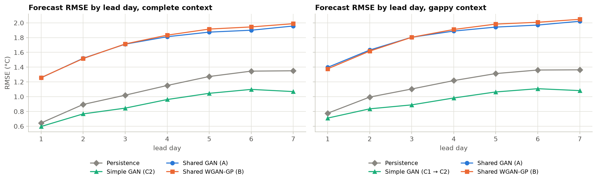
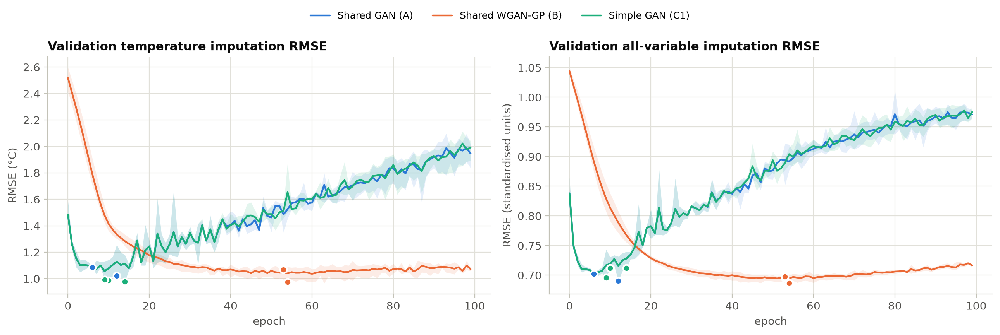

# Adversarial Forecasting: A GAN-Based Framework for Time-Series Imputation and Weather Prediction

[](https://colab.research.google.com/github/Melvin0163/Adversarial-Forecasting-A-GAN-Based-Framework-for-Time-Series-Imputation-and-Weather-Prediction/blob/main/Adversarial_Forecasting_GAN.ipynb)

Generative adversarial networks (GANs) for two related problems in daily weather records:

- **Imputation**: reconstructing values missing from a multivariate record, both isolated days and multi-day gaps.
- **Forecasting**: predicting the next 7 days of air temperature from the recent past.

The study uses 76 years (1950–2025) of ERA5-Land daily reanalysis for Chennai, India. Missing data are simulated realistically, and every model is evaluated on a held-out *future* period against simple baselines. The whole study is one end-to-end notebook: [`Adversarial_Forecasting_GAN.ipynb`](Adversarial_Forecasting_GAN.ipynb).

## Models

| Model | Generator | Adversary | Tasks |
|---|---|---|---|
| **A. Shared GAN** | Shared BiLSTM masked-sequence generator | GAIN-style point-wise discriminator (binary cross-entropy) | imputation; forecasting by masking the final 7 days |
| **B. Shared WGAN-GP** | Same shared generator architecture | Block-level Wasserstein critic with gradient penalty | imputation; forecasting by masking the final 7 days |
| **C. Simple GAN** | One network per task | C1: GAIN-style discriminator · C2: conditional discriminator | C1 imputation only · C2 forecasting only |

"Shared" means two things. Models A and B use the same generator architecture, so the comparison between them isolates the adversarial objective (binary cross-entropy vs. Wasserstein distance). And each trained generator serves both tasks: it fills interior gaps, and it forecasts when the last days of a window are masked. The Simple GAN is the task-specific counterpart.

## Data

Daily aggregates from **ERA5-Land** (`ECMWF/ERA5_LAND/DAILY_AGGR`), extracted with Google Earth Engine at 80.23° E, 13.08° N (Chennai), 1950-01-02 to 2025-12-30 (27,757 days). The extract is included in [`data/era5_chennai_1950_2025.csv`](data/era5_chennai_1950_2025.csv).

| Column | Unit | Daily statistic |
|---|---|---|
| `temp` (2 m air temperature, the target) | °C | mean |
| `surface_pressure` | Pa | mean |
| `total_precipitation_sum` | m | total |
| `dewpoint_temperature_2m` | K | mean |
| `u_component_of_wind_10m`, `v_component_of_wind_10m` | m s⁻¹ | mean |

The notebook also contains the Earth Engine extraction code (Section 1), so the extract can be regenerated with a Google Cloud project that has the Earth Engine API enabled.

## Experimental protocol

1. **Chronological split.** The series is cut into non-overlapping 30-day blocks: 70 % for training (1950–2003), 15 % for validation (2003–2014) and 15 % for the held-out test period (2014–2025).
2. **Scaling.** Each variable is z-scored with training-period statistics only.
3. **Synthetic missingness** (fixed seed, identical for every model). For each variable, 10 % of days are removed at random and about 10 % more as contiguous 3–10-day gaps, about 18.5 % of all values in total. Removed values are kept as ground truth.
4. **Model input.** Zero-filled values plus a missing-value indicator for each 30-day block (30 days × 12 channels).
5. **Training.** Each model keeps the weights of its best validation epoch; the test period is never used for any choice.
6. **Evaluation**, averaged over 3 model seeds (mean ± std):
   - *Imputation:* RMSE, MAE and R² for temperature in °C, and all-variable errors, measured only at the removed entries. Baseline: linear interpolation. Errors are also broken down by gap length.
   - *Forecasting:* identical 7-day targets for every model. RMSE, MAE, R², skill against persistence, and error by lead day. The evaluation is repeated with gaps left in the input history.

## Results

Held-out test period 2014-06-25 to 2025-12-23, mean ± standard deviation over 3 seeds. The numbers come from the executed notebook in this repository, which also saves every table and figure in [`outputs/`](outputs/). The run used a 4-core CPU with TensorFlow 2.21 and took 55 minutes; two complete runs gave identical numbers. On a GPU, results can differ slightly.

**Imputation** of the 702 removed temperature values:

| Model | RMSE (°C) ↓ | MAE (°C) ↓ | R² ↑ |
|---|---|---|---|
| Shared GAN (A) | 0.954 ± 0.066 | 0.729 ± 0.045 | 0.848 ± 0.021 |
| Shared WGAN-GP (B) | 0.969 ± 0.058 | 0.745 ± 0.041 | 0.843 ± 0.019 |
| Simple GAN (C1) | 0.904 ± 0.026 | 0.694 ± 0.015 | 0.864 ± 0.008 |
| Linear interpolation | **0.672** | **0.488** | **0.925** |

**7-day temperature forecasting** on 596 test windows. Skill is 1 − RMSE / RMSE of persistence. With gaps in the input history, the Simple GAN first fills them with C1 and then forecasts with C2.

| Model | RMSE (°C) ↓, complete history | Skill ↑ | RMSE (°C) ↓, history with gaps | Skill ↑ |
|---|---|---|---|---|
| Persistence | 1.124 | 0 | 1.179 | 0 |
| Simple GAN (C2) | **0.928 ± 0.011** | **0.174 ± 0.010** | **0.963 ± 0.016** | **0.183 ± 0.013** |
| Shared GAN (A) | 1.735 ± 0.114 | −0.543 ± 0.102 | 1.820 ± 0.099 | −0.544 ± 0.084 |
| Shared WGAN-GP (B) | 1.757 ± 0.233 | −0.563 ± 0.207 | 1.836 ± 0.231 | −0.557 ± 0.196 |



**Key findings**

1. **The conditional forecasting GAN (C2) beats persistence at every lead day**, from 0.60 vs. 0.64 °C on day 1 to 1.07 vs. 1.35 °C on day 7. It keeps its skill when the input history has gaps.
2. **No GAN imputer beats linear interpolation overall.** C1 is marginally ahead only on 2–3-day gaps (0.82 vs. 0.85 °C). The GAIN-style discriminator sees the full observation mask, and its loss falls from about 0.7 to 0.002, consistent with it reading the mask instead of the values. From then on nothing trains the generator on the missing entries: validation error is lowest after 6–14 epochs and then rises, so checkpoint selection matters.
3. **Cross-entropy vs. Wasserstein: same accuracy, different training.** The WGAN-GP matches the GAN within one seed standard deviation and trains steadily. Like the GAN, it has no loss term that compares the filled-in values with the true ones.
4. **The shared generators do not forecast** (skill about −0.55). Imputation training alone does not transfer to filling the last 7 days of a window.
5. **Next steps:** GAIN's hint mechanism, masked-reconstruction training (hide some observed values and reconstruct them), and trailing gaps in the training masks of the shared generators.



The notebook discusses these results in Sections 10 and 11.

## Running the notebook

**Google Colab (recommended).** Click the badge above, optionally choose *Runtime → Change runtime type → T4 GPU*, then *Runtime → Run all*. The data are downloaded from this repository automatically.

**Locally** (Python 3.10+):

```bash
git clone https://github.com/Melvin0163/Adversarial-Forecasting-A-GAN-Based-Framework-for-Time-Series-Imputation-and-Weather-Prediction.git
cd Adversarial-Forecasting-A-GAN-Based-Framework-for-Time-Series-Imputation-and-Weather-Prediction
pip install -r requirements.txt
jupyter lab Adversarial_Forecasting_GAN.ipynb
```

A GPU is optional: the published run (3 seeds) took 55 minutes on a 4-core CPU. To check that everything runs, set `QUICK_TEST = True` in Section 0 (2 epochs, 1 seed, a few minutes). All settings (seeds, split, missingness, hyperparameters) live in the configuration cell of Section 0.

## Outputs

Running the notebook writes everything to `outputs/`. The outputs of the published run are included in this repository, except the model weights.

| Path | Content |
|---|---|
| `results_summary.md` | headline results and the final tables in Markdown |
| `imputation_metrics_*.csv`, `imputation_temp_rmse_by_gap_length.csv` | imputation scores (per seed and summarised) |
| `imputation_calibration.csv` | bias, spread and slope of the imputed temperatures |
| `forecast_metrics_*.csv`, `forecast_rmse_by_lead_day.csv` | forecasting scores (per seed and summarised) |
| `run_summary.json` | configuration, selected epochs, runtimes, all scores and package versions |
| `figures/` | all figures at 200 dpi |
| `models/` | trained generator weights (not tracked by git) |

## Repository structure

```
├── Adversarial_Forecasting_GAN.ipynb   # complete study, executed: data → models → evaluation → discussion
├── data/
│   └── era5_chennai_1950_2025.csv      # ERA5-Land extract used in the study
├── outputs/                            # tables, figures and run summary of the published run
│   └── figures/
├── requirements.txt
└── README.md
```

## Limitations

The notebook discusses these in detail (Section 11). In brief:

- The GAIN-style discriminators see the full observation mask. They saturate and stop guiding the generator on the missing entries, which leaves checkpoint selection to do much of the work.
- The shared generators are trained only on imputation gaps, so their forecasting scores measure transfer rather than dedicated forecasting skill. Here the transfer fails.
- Missingness is synthetic (random and block-wise). The results come from a single site, with point-error metrics only.

## References

- Muñoz-Sabater, J. et al. (2021). ERA5-Land: a state-of-the-art global reanalysis dataset for land applications. *Earth System Science Data*, 13, 4349–4383.
- Gorelick, N. et al. (2017). Google Earth Engine: planetary-scale geospatial analysis for everyone. *Remote Sensing of Environment*, 202, 18–27.
- Goodfellow, I. et al. (2014). Generative adversarial nets. *NeurIPS*, 27.
- Yoon, J., Jordon, J. & van der Schaar, M. (2018). GAIN: missing data imputation using generative adversarial nets. *ICML*, PMLR 80, 5689–5698.
- Arjovsky, M., Chintala, S. & Bottou, L. (2017). Wasserstein generative adversarial networks. *ICML*, PMLR 70, 214–223.
- Gulrajani, I. et al. (2017). Improved training of Wasserstein GANs. *NeurIPS*, 30.
- Mirza, M. & Osindero, S. (2014). Conditional generative adversarial nets. arXiv:1411.1784.
- Du, W., Côté, D. & Liu, Y. (2023). SAITS: self-attention-based imputation for time series. *Expert Systems with Applications*, 219, 119619.

The full reference list is in the notebook.

## Data licence and attribution

ERA5-Land is produced by ECMWF for the Copernicus Climate Change Service and distributed under the Licence to Use Copernicus Products. The extract in `data/` contains modified Copernicus Climate Change Service information (1950–2025). Neither the European Commission nor ECMWF is responsible for any use of this information.
