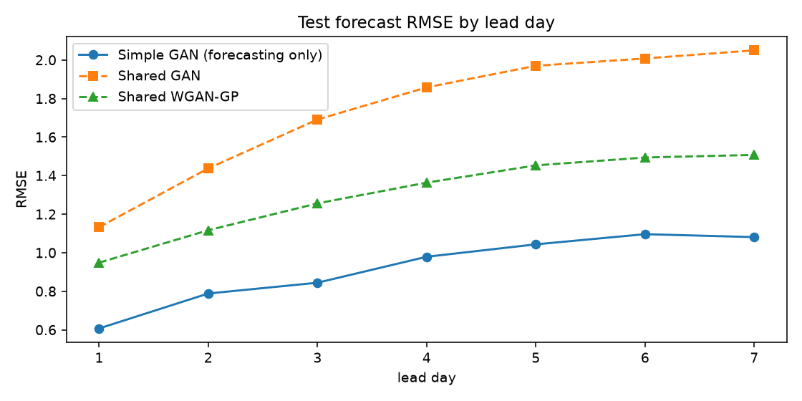
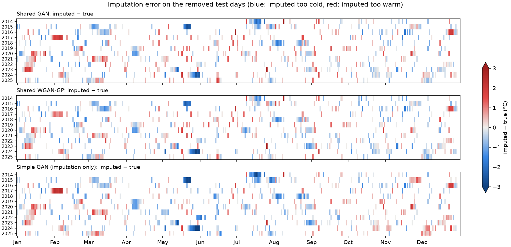

# Adversarial Forecasting: A GAN-Based Framework for Time-Series Imputation and Weather Prediction

[](https://colab.research.google.com/github/Melvin0163/Adversarial-Forecasting-A-GAN-Based-Framework-for-Time-Series-Imputation-and-Weather-Prediction/blob/main/Adversarial_Forecasting_GAN.ipynb)

GAN variants for two tasks on daily weather data:

- **Imputation:** filling values missing from a six-variable daily record.
- **Forecasting:** predicting the next 7 days of air temperature.

The study tests the claim that a **unified, shared GAN architecture** (one generator for both tasks) is an optimized way to handle both, compared with a **Simple GAN** approach that trains a separate GAN for each task. "Optimized" is assessed on accuracy, number of parameters and training time. The data are 76 years (1950–2025) of ERA5-Land daily reanalysis for Chennai, India. The whole study is one notebook: [`Adversarial_Forecasting_GAN.ipynb`](Adversarial_Forecasting_GAN.ipynb).

A complete walkthrough of the project, covering the data, pipeline, models, metrics, results and every notebook section, is in [`PROJECT_GUIDE.md`](PROJECT_GUIDE.md).

## Models

| Model | Generator | Adversary | Trained on | Evaluated on |
|---|---|---|---|---|
| **Shared GAN** | BiLSTM generator over 30-day blocks (shared architecture) | GAIN-style point-wise discriminator (binary cross-entropy) | imputation | imputation and forecasting |
| **Shared WGAN-GP** | same generator architecture | block-level Wasserstein critic with gradient penalty | imputation, with re-masking of observed values | imputation and forecasting |
| **Simple GAN** | one generator per task | GAIN-style discriminator (imputation); conditional discriminator (forecasting) | each task separately | the task it was trained for |

Only GAN variants are compared; no non-GAN baseline is included.

## Data

Daily aggregates from **ERA5-Land** (`ECMWF/ERA5_LAND/DAILY_AGGR`), extracted with Google Earth Engine at 80.23° E, 13.08° N (Chennai), from 1950-01-02 to 2025-12-30 (27,757 days). The extract is included in [`data/era5_chennai_1950_2025.csv`](data/era5_chennai_1950_2025.csv), and the notebook contains the extraction code (Section 1).

| Column | Unit | Daily statistic |
|---|---|---|
| `temp` (2 m air temperature, the target) | °C | mean |
| `surface_pressure` | Pa | mean |
| `total_precipitation_sum` | m | total |
| `dewpoint_temperature_2m` | K | mean |
| `u_component_of_wind_10m`, `v_component_of_wind_10m` | m s⁻¹ | mean |

## Experimental setup

1. **Chronological split** of the series into non-overlapping 30-day blocks: 647 for training (1950–2003), 138 for validation (2003–2014) and 140 for testing (2014–2025). The forecasting experiment uses the same period boundaries.
2. **Scaling:** each variable is z-scored with training-period statistics only.
3. **Missingness** (seed 42, identical for every model): for each variable, 10 % of the days are removed at random and about 10 % more as contiguous runs of 3–10 days, 18.5 % of all values in total. The removed values are kept as ground truth.
4. **Model input** for the imputation models: zero-filled values plus a missing-value indicator for each 30-day block (30 days × 12 channels).
5. **Training:** each model keeps the weights of its best validation epoch. Every model is trained once, with seed 42.
6. **Evaluation** on the test period:
   - *Imputation:* RMSE and MAE at the removed positions only, for temperature and for all six variables, in scaled units.
   - *Forecasting:* 7-day temperature forecasts for 596 test windows; RMSE and MAE (°C and scaled), R², and RMSE by lead day. The shared generators forecast by filling the last 7 days of a 30-day block whose first 23 days are observed.
   - *Efficiency:* trainable parameters and training time.

## Results

The numbers below are those of the run shown in the notebook: one run with seed 42, on a CPU with TensorFlow 2.21. The test period is 2014–2025: 140 blocks for imputation and 596 windows for forecasting. Best values are in bold.

**Imputation** (removed test positions, scaled units, lower is better)

| Model | `impute_rmse_temp` | `impute_mae_temp` | `impute_rmse_allfeat` | `impute_mae_allfeat` |
|---|---|---|---|---|
| Shared GAN | 0.3107 | 0.2397 | 0.8467 | 0.4416 |
| Shared WGAN-GP | **0.2896** | **0.2218** | **0.7865** | **0.3838** |
| Simple GAN (imputation only) | 0.3255 | 0.2461 | 0.8568 | 0.4449 |

**7-day temperature forecasting** (596 test windows)

| Model | `RMSE_degC` | `MAE_degC` | `R2` | `RMSE_scaled` | `MAE_scaled` |
|---|---|---|---|---|---|
| Shared GAN | 1.5395 | 1.2129 | 0.6063 | 0.5580 | 0.4396 |
| Shared WGAN-GP | 1.2309 | 0.9783 | 0.7484 | 0.4461 | 0.3546 |
| Simple GAN (forecasting only) | **0.9539** | **0.7196** | **0.8489** | **0.3457** | **0.2608** |

RMSE by lead day, from day 1 to day 7: Simple GAN 0.60 to 1.11 °C, Shared WGAN-GP 0.96 to 1.39 °C, Shared GAN 0.95 to 1.95 °C.

**Parameters and training time**

| Approach | Generators for both tasks | Generator parameters | Parameters incl. discriminator/critic | Training time (min) |
|---|---|---|---|---|
| Shared GAN | 1 | **146,886** | **175,260** | **3.1** |
| Shared WGAN-GP | 1 | **146,886** | 193,639 | 8.1 |
| Simple GAN | 2 | 203,725 | 256,964 | 12.0 (2.6 imputation + 9.4 forecasting) |

**Summary**

* **Imputation:** the Shared WGAN-GP has the lowest error of the three models on all four metrics. Its temperature RMSE is 11 % lower than the Simple GAN's (0.2896 vs. 0.3255) and 7 % lower than the Shared GAN's (0.3107).
* **Forecasting:** the Simple GAN forecaster, trained for this task, has the lowest error. The RMSE of the Shared WGAN-GP is 29 % higher (1.231 vs. 0.954 °C), and that of the Shared GAN 61 % higher (1.540 °C).
* **Cost:** each shared model handles both tasks with one generator of 146,886 parameters, 28 % fewer than the two generators of the Simple GAN approach (203,725), and with one training run: 3.1 min (Shared GAN) and 8.1 min (Shared WGAN-GP), against 12.0 min for the two Simple GAN networks on the same CPU.
* **Training:** the validation error of the Shared WGAN-GP was still decreasing at the last of its 100 epochs.
* **The claim:** in this run, the shared architecture needs fewer parameters and less training time for the two tasks, and the Shared WGAN-GP is the most accurate imputer. For forecasting, the dedicated Simple GAN forecaster is more accurate than both shared models.






## Running the notebook

**Google Colab.** Click the badge above, then *Runtime → Run all*. The data are downloaded from this repository automatically.

**Locally** (Python 3.10+):

```bash
git clone https://github.com/Melvin0163/Adversarial-Forecasting-A-GAN-Based-Framework-for-Time-Series-Imputation-and-Weather-Prediction.git
cd Adversarial-Forecasting-A-GAN-Based-Framework-for-Time-Series-Imputation-and-Weather-Prediction
pip install -r requirements.txt
jupyter lab Adversarial_Forecasting_GAN.ipynb
```

The run shown in the notebook took 25 minutes on a 4-core CPU with TensorFlow 2.21; a GPU runtime is optional.

## Outputs

Running the notebook writes these files to `outputs/`; the files of the run shown are included in this repository.

| File | Content |
|---|---|
| `model_comparison_metrics.csv` | imputation metrics of the Shared GAN and the Shared WGAN-GP |
| `gan_imputation_only_metrics.csv` | imputation metrics of the Simple GAN |
| `gan_forecasting_only_metrics.csv` | forecasting metrics of the Simple GAN |
| `forecast_comparison_metrics.csv` | forecasting metrics of all three models |
| `comparison_accuracy.csv`, `comparison_efficiency.csv` | the comparison tables of Section 9 |
| `run_summary.json` | data summary, hyperparameters and metrics of the shared models |
| `*.png` | all figures, including the temporal maps of the imputed temperatures |

## Repository structure

```
├── Adversarial_Forecasting_GAN.ipynb   # the complete, executed study
├── PROJECT_GUIDE.md                    # complete walkthrough of the project
├── data/
│   └── era5_chennai_1950_2025.csv      # ERA5-Land extract used in the study
├── outputs/                            # tables and figures of the run shown
├── requirements.txt
└── README.md
```

## References

- Muñoz-Sabater, J. et al. (2021). ERA5-Land: a state-of-the-art global reanalysis dataset for land applications. *Earth System Science Data*, 13, 4349–4383.
- Gorelick, N. et al. (2017). Google Earth Engine: planetary-scale geospatial analysis for everyone. *Remote Sensing of Environment*, 202, 18–27.
- Goodfellow, I. et al. (2014). Generative adversarial nets. *Advances in Neural Information Processing Systems*, 27.
- Yoon, J., Jordon, J. & van der Schaar, M. (2018). GAIN: missing data imputation using generative adversarial nets. *ICML*, PMLR 80, 5689–5698.
- Arjovsky, M., Chintala, S. & Bottou, L. (2017). Wasserstein generative adversarial networks. *ICML*, PMLR 70, 214–223.
- Gulrajani, I. et al. (2017). Improved training of Wasserstein GANs. *Advances in Neural Information Processing Systems*, 30.
- Mirza, M. & Osindero, S. (2014). Conditional generative adversarial nets. arXiv:1411.1784.

## Data licence and attribution

ERA5-Land is produced by ECMWF for the Copernicus Climate Change Service and distributed under the Licence to Use Copernicus Products. The extract in `data/` contains modified Copernicus Climate Change Service information (1950–2025). Neither the European Commission nor ECMWF is responsible for any use of this information.
